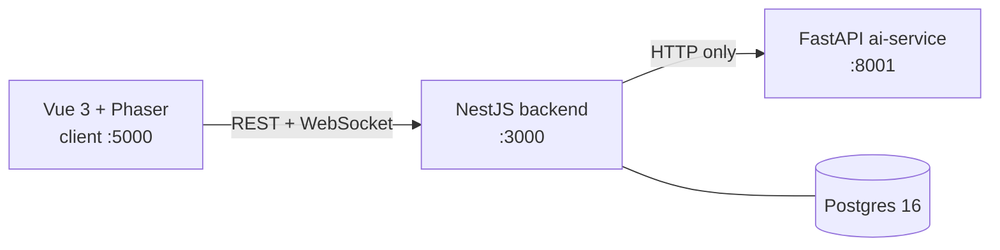

# poc-agentic-office

A proof-of-concept: a gamified office where productivity tools are AI agents.

## What this is

You walk around an office as a sprite, and the productivity tools you'd
normally open in a browser tab are instead AI agents you physically approach
at a desk or a room. The stack is three services plus a database: a Vue 3 +
Phaser client (the office you walk around in) that never calls FastAPI
directly, a NestJS backend (auth, chat, world state, and orchestration), and
a FastAPI ai-service (the AI agents themselves), backed by Postgres.

<!-- Screenshot/GIF slot: office walkthrough. Drop an image here when captured. -->

## The office

| Where | Opens | What it does |
|---|---|---|
| Newsstand | AI news | Fetches a recent AI story and summarizes it in plain language |
| Main computers (top) | LinkedIn writer | Turns a short input into a LinkedIn-style post |
| Main computers (bottom) | 515 drafter | Drafts and revises your weekly 515, sends it via Outlook |
| Video room | Sprite studio | Generates your character sheet from a photo or a description |
| Meeting room table | Chat room | 1:1 and group chat with whoever else is in the office |

Two features are ambient rather than zone-gated. Presence and movement —
other players' positions — stream over the realtime gateway no matter where
you are. The mini-me avatar assistant is a backend detector that surfaces a
reminder when your Friday 515 is missing; the client polls for it rather than
you having to walk up to anything. The rest of the map is flavor.

## Architecture at a glance



NestJS owns auth, chat, world state, persistence, and orchestration. FastAPI
is an HTTP-only AI execution layer that is stateless from the backend's
perspective and holds no database of its own. The client never calls FastAPI
directly — every agent request goes through the backend.

See [docs/architecture.md](docs/architecture.md) for the full picture.

## Tech stack

- Turborepo + pnpm 10.6.5
- Vue 3 + Phaser + Vite + Tailwind
- NestJS + Passport JWT + Socket.IO
- Drizzle ORM + Postgres 16
- FastAPI + OpenAI

## Quick start

Prerequisites: Node, pnpm 10.6.5, Python, Docker.

```bash
cp apps/backend/.env.example apps/backend/.env
cp apps/ai-service/.env.example apps/ai-service/.env
pnpm install

pnpm db:up
docker compose ps                 # confirm postgres is "healthy" before migrating

pnpm --filter @agentic-office/backend db:migrate

cd apps/ai-service
python -m venv .venv
source .venv/bin/activate
pip install -r requirements.txt
cd ../..

# Run pnpm dev from the SAME shell where the venv above is still active —
# ai-service's turbo `dev` script shells out to `python -m uvicorn`, and it
# needs the venv's uvicorn on PATH. A fresh shell without the venv active
# will not find it.
pnpm dev
```

Then open `http://localhost:5000`.

`pnpm dev` is a persistent task and does not exit on its own — stop it with
Ctrl-C (or `pkill`, since it spawns vite, nest, and uvicorn as separate
processes).

**What works without credentials:** `pnpm dev` alone gets you a walkable
office with working auth and chat. Each agent additionally needs its own
credentials in `apps/ai-service/.env`:

- `OPENAI_API_KEY` — LinkedIn writer, AI news, sprite studio
- Cloudinary (`CLOUDINARY_CLOUD_NAME`, `CLOUDINARY_API_KEY`, `CLOUDINARY_API_SECRET`) — hosted sprite assets
- Microsoft Graph (`MICROSOFT_CLIENT_ID`, `MICROSOFT_CLIENT_SECRET`, `MICROSOFT_TENANT_ID`, `MICROSOFT_REDIRECT_URI`) — 515 drafter

## Ports

| Service | Port |
|---|---|
| `apps/client` | 5000 |
| `apps/backend` | 3000 |
| `apps/ai-service` | 8001 |

## Project layout

- `apps/client` — Vue 3 + Phaser office
- `apps/backend` — NestJS API, realtime gateway, agent bridge
- `apps/ai-service` — FastAPI agent execution
- `packages/shared-types` — shared TS contracts

## Docs

- [Architecture overview](docs/architecture.md) — how the pieces fit together
- [Backend API reference](docs/backend-api-reference.md) — every route in detail
- [AI service implementation guide](docs/ai-service-implementation-guide.md) — what FastAPI implements
- [Backend specs](docs/backend-spec/) — domain model, auth, chat, realtime, conventions
- [Frontend auth](docs/frontend-auth/) — client auth flow and state
