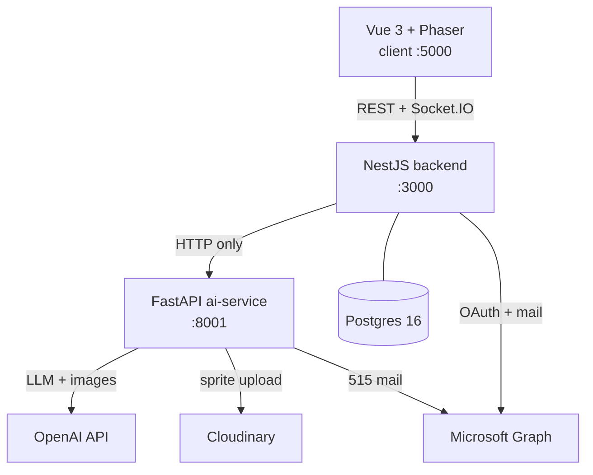
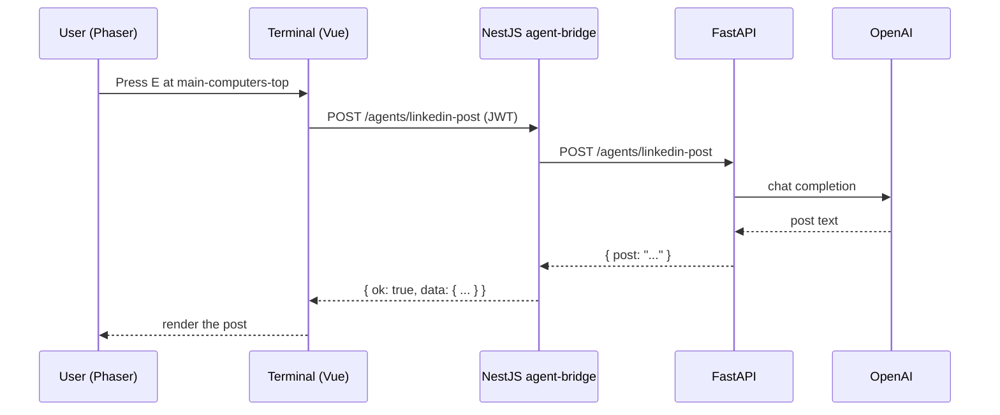

# Architecture

This document describes what is built today: the four workspaces that make up
the project, how they talk to each other, and which parts of each spec are
actually wired up. It defers to the specs under `backend-spec/` and the other
top-level docs for implementation depth — this page exists so there is one
place that ties those specs together, not a fourth competing source of truth.

The repository is a pnpm/turbo monorepo with four workspaces: `apps/client`
(the Vue 3 + Phaser game), `apps/backend` (NestJS), `apps/ai-service`
(FastAPI), and `packages/shared-types` (TypeScript interfaces shared between
the client and the backend, such as the health-check and API event shapes).
Nothing in this document is aspirational — every diagram and table below
reflects code that runs when the stack is started.

## System overview

Microsoft Graph is reached from two independent places: the backend uses it
for OAuth login and mail, and the ai-service uses it for sending the 515
report mail. Both services hold their own Graph credentials today; there is
no shared Graph client between them.

The client never talks to FastAPI, OpenAI, Cloudinary, or Microsoft Graph
directly — every client request reaches them only after passing through the
NestJS backend first. The backend is the only workspace with a database
connection, but it is not the only workspace holding external credentials:
the ai-service reaches OpenAI, Cloudinary, and Microsoft Graph itself, using
credentials of its own.

## Responsibility split

NestJS owns everything that has state or a client-facing contract: auth,
users, chat, presence, world state, the WebSocket gateway, Postgres
persistence, agent orchestration, and logging. FastAPI owns AI execution only
— it is stateless from the backend's perspective and holds no database
connection of its own. The integration rule between the two is simple: HTTP
only, one direction, backend calls ai-service.

FastAPI never calls back into NestJS, never touches Postgres, and never
receives a client request directly — the client does not know the
ai-service's port or address, only the backend's. This keeps the AI
execution layer swappable and testable in isolation: as long as an
ai-service implements the same HTTP contract, the backend does not care what
model, prompt, or provider sits behind it. FastAPI does use file-based
storage internally for its own implementation, but NestJS treats that as an
implementation detail and never relies on it as a system of record — Postgres
is the only durable store for the system as a whole. See
[Backend architecture](backend-spec/01-architecture.md) for the full detail
on this split.

## Agent request flow

The agent flow is the core interaction of the app: the player walks a sprite
up to a desk, presses a key, and a chat-style terminal opens and calls out to
an AI agent. That call is synchronous end to end.

The controller awaits `AgentBridgeService`, which awaits
`FastapiClientService`, inline — there is no queue and no polling; the HTTP
request from the client stays open until the agent finishes. Every request is
logged through `AgentBridgeLogsRepository`. The backend normalizes whatever
shape FastAPI returns into its own response envelope, which is why the client
never has to know FastAPI's response shapes — it only ever sees NestJS's
envelope. Because some agents generate images, `AI_AGENTS_TIMEOUT_MS`
defaults to 300000 (5 minutes) rather than a typical HTTP timeout — the
client-facing request simply waits for that long if the model is slow.

There is no queue, no job table, and no separate polling endpoint in this
path: the sequence above — press E, POST, POST, await, respond, render — is
the entire lifecycle of an agent request.

## Response envelope

Every backend response, success or failure, is wrapped in the same union
shape: `{ ok: true, data }` on success or `{ ok: false, error }` on failure.
Controllers produce the success shape with `toApiSuccessResponse` rather than
returning raw data, so every endpoint — REST or agent-bridge — is
predictable to consume from the client without per-route special cases. A
caller can always branch on `ok` to know whether to read `data` or `error`,
regardless of which route or which underlying service produced the response.
The `error` object itself carries a stable, machine-readable `code` alongside
a human-readable `message`, so the client can branch on `code` for behavior
and use `message` only for display. See
[API conventions](backend-spec/08-api-conventions.md) for the full envelope
and error-code shape.

## Auth

Authentication is Passport JWT with an access/refresh pair issued and
verified by `token.service.ts`. The access token defaults to a 15 minute TTL
(`15m`); a refresh token is used to reissue it. Both signing secrets fall
back to hardcoded defaults in code if the corresponding environment variables
are unset, so the stack still boots in an unconfigured environment rather
than failing to start. That default is convenient for local development and
is also why deployment configuration must set real secrets explicitly rather
than relying on the code's fallback. The same JWT is required on the
WebSocket connection described below, not just on REST calls — an invalid or
missing token rejects the socket connection outright. See
[Auth](backend-spec/02-auth.md) for the backend side and
[Frontend auth](frontend-auth/) for how the client stores and refreshes
tokens.

## Realtime

The gateway is Socket.IO. Inbound, the backend handles `presence:join`,
`presence:update`, `chat:send`, and `user:move`. Outbound, it emits five
events: `presence:update`, `chat:message`, `chat:ack`, `user:move`, and
`error`. `presence:update` and `user:move` are bidirectional — each is both
received from and sent back to clients. Realtime carries no agent events at
all — agents are strictly HTTP
request/response, handled entirely by the agent-bridge flow described above;
the gateway never emits or listens for anything agent-related.

Presence, socket-to-user mappings, room membership, and player positions are
held in memory in `PresenceService`'s plain JS `Map`s, not in Postgres — there
is no repository and no database call backing any of it, so a server restart
loses all of it. Chat is different: messages sent through `chat:send` are
persisted to Postgres, so chat history survives a reconnect or a restart even
though presence does not. See
[Realtime / WebSocket](backend-spec/05-realtime-websocket.md) for the full
event catalog.

## Persistence

The backend uses Drizzle against Postgres 16 as its only datastore; neither
the client nor the ai-service has a database connection of its own. Ten
tables are live:

**Identity & auth**
- `users` — account records, credentials, and the refresh token hash used to
  reissue access tokens (there is no separate refresh-tokens table)
- `external_accounts` — linked external provider accounts (e.g. Microsoft) per user
- `oauth_states` — short-lived state values for the OAuth handshake

**World state**
- `rooms` — the set of rooms in the office map

**Chat**
- `conversations` — a chat conversation, optionally tied to a room
- `conversation_participants` — membership of users in a conversation
- `conversation_reads` — each user's last-read position in a conversation
- `messages` — persisted chat messages

**Agents & ops**
- `logs` — a log row per event, including agent-bridge requests made through
  the agent flow above
- `assistant_notifications` — messages queued for the avatar assistant to surface

These ten map directly onto the responsibility split above: identity backs
auth, world state backs the room model, chat backs the realtime gateway's
persisted history, and the agents-and-ops group backs the agent-bridge flow
and the avatar assistant. Presence, socket state, and per-frame movement are
not in this list — as the realtime section above describes, those stay in an
in-memory `Map` and are never written to a table. See
[Persistence](backend-spec/07-persistence.md) for column-level detail.

## Avatar assistant

The avatar assistant is the one component in the system that acts without a
client-initiated agent call. `Proactive515Detector.detect` reads backend
state and, when conditions are met, writes a row through
`assistant-notifications.repository.ts`. There is no separate mechanism that
triggers this on its own: `AvatarAssistantService` invokes `detect`
synchronously, inline, from inside the handler for
`GET /avatar-assistant/message` — the detection logic only ever runs because,
and exactly when, the client makes that request. The client has no push
channel for this — it polls that same endpoint to pick up anything the
detector has written. Every other capability described above is triggered by
something the user did directly; this is the closest thing to an exception,
and it stays scoped to that single detector and that single polling
endpoint.

## Read next

This document is the map; the specs below are the territory. Start here,
then go to whichever of these covers the part you're changing.

- [Backend API reference](backend-api-reference.md) — every route, request, and response
- [AI service implementation guide](ai-service-implementation-guide.md) — what FastAPI actually implements
- [Backend specs](backend-spec/) — domain model, auth, chat, realtime, error codes, conventions
- [Frontend auth](frontend-auth/) — client auth flow, state, routing, security
