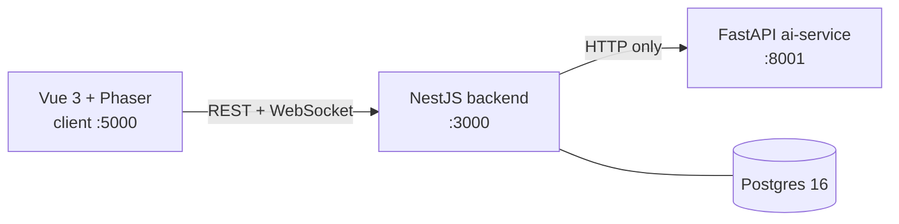
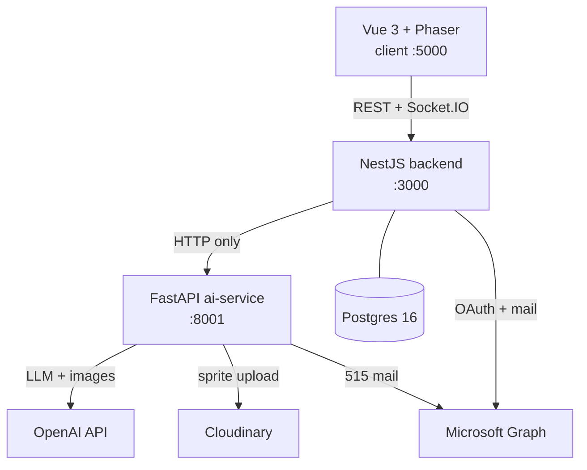
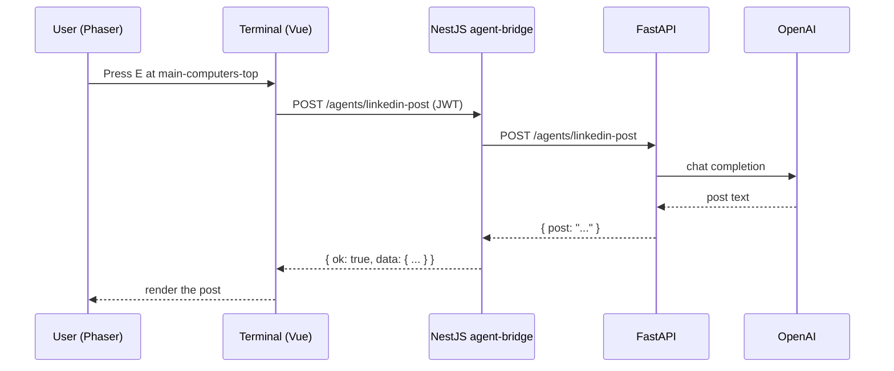

# README Overhaul Implementation Plan

> **For agentic workers:** REQUIRED SUB-SKILL: Use superpowers:subagent-driven-development (recommended) or superpowers:executing-plans to implement this plan task-by-task. Steps use checkbox (`- [ ]`) syntax for tracking.

**Goal:** Replace a 65-line README that documents how to boot the stack but never says what it is, and add a system-wide architecture overview — both describing only what actually runs today.

**Architecture:** Two documents. `README.md` is the front door (what it is, agent table, one diagram, a quick start that works, curated links). `docs/architecture.md` is the depth (system diagram, sync agent flow, envelope, auth, realtime, persistence, avatar assistant, read-next map). No existing doc is edited.

**Tech Stack:** Markdown, mermaid (GitHub-native rendering). No code changes.

**Spec:** `docs/superpowers/specs/2026-07-15-readme-overhaul-design.md`

## Global Constraints

- **Tone:** straight and technical throughout. The app performs the joke; the docs do not.
- **Visuals:** mermaid only. No screenshots. Screenshot slots as HTML comments only.
- **No forward-looking content.** No roadmap, no "how to add an agent" walkthrough, no "coming soon".
- **Document only what runs.** Code that exists but is not wired is not described. See "Verified facts" below.
- **No existing doc may be edited, moved, or annotated.** Deliverables are `README.md` (rewrite) and `docs/architecture.md` (new) only.
- **No code changes.** Including `.env.example` files.
- **Never link** `docs/frontend-backend-api-mismatches.md`, `docs/microsoft-oauth-migration-plan.md`, `docs/chat-room-implementation.md`, `docs/frontend-agent-api-audit.md`, or `docs/sprite-generation-flow.md`.
- **A claim that cannot be verified comes out.** It does not get hedged into vagueness.
- Branch: `docs/readme-overhaul`. Spec already committed.

## Content-completeness note

For documentation deliverables, "complete content in every step" means: every **fact, command, table, link, and mermaid diagram** is given verbatim below and must be copied exactly. Connecting prose is written at execution time against the stated requirements. Do not invent facts not listed here — if a needed fact is missing, verify it against the code and report it rather than guessing.

---

## Verified facts (established at plan time — do not re-derive, do not contradict)

These were verified by reading the code on 2026-07-15. They **correct the spec** in three places; the corrections are authoritative.

### Ports
- client `5000` (`apps/client/vite.config.ts:14`) — **not** 5173
- backend `3000` (`apps/backend/src/main.ts:14`, `process.env.PORT ?? 3000`)
- ai-service `8001` (`apps/ai-service/package.json` dev script)

### Agent surfaces (only these four; ~14 other zones are flavor)
| Zone id | Where | Agent | Endpoint |
|---|---|---|---|
| `newstand-panel` | Newsstand | AI news | `GET /agents/ai-news` |
| `main-computers-top` | Main computers (top) | LinkedIn writer | `POST /agents/linkedin-post` |
| `main-computers-bottom` | Main computers (bottom) | 515 drafter | `POST /agents/weekly-report/*` |
| `video-room` | Video room | Sprite studio | `POST /agents/sprite-sheet` |

### The agent flow is SYNCHRONOUS
Controller → `AgentBridgeService` → `FastapiClientService` → FastAPI, awaited inline.

**SPEC CORRECTION.** The spec said to document an async variant (AgentJob row + WebSocket notify). It does not exist:
- `AgentJobsService` is **not** in the providers array of `agent-bridge.module.ts`. Nest never instantiates it. Nothing injects it.
- `agent-jobs.repository.ts` is referenced only by that dead service.
- Per the "document only what runs" decision: **do not mention** AgentJobsService, agent-jobs.repository, the `agent_jobs` table, `agent:pending`, or `agent:error` in either deliverable.
- `docs/backend-spec/06-agent-bridge.md` describes this async strategy as if live. It is out of scope and must not be edited, contradicted, or linked from the flow section.

### Realtime events
**SPEC CORRECTION.** The spec said "the four implemented events". The constants file (`apps/backend/src/common/constants/realtime-events.constants.ts`) declares 16 names; only these are wired.

Inbound (`@SubscribeMessage` handlers in `realtime.gateway.ts`) — document these four:
- `presence:join`, `presence:update`, `chat:send`, `user:move`

Outbound (actually emitted) — document these:
- `presence:update`, `chat:ack`, `chat:message`, `agent:result`, `error`

Declared but unwired — **do not document**: `room:join`, `room:leave`, `chat:typing`, `agent:request`, `room:state`, `user:position`, `agent:pending`, `agent:error`.

### Persistence
**SPEC CORRECTION.** The spec said "14 tables". `apps/backend/src/database/schema/` holds 15 files, of which 3 are not tables (`enums.schema.ts`, `index.ts`, `relations.ts`) → **12 tables defined**. Two are dead and must not be documented:
- `agent_jobs` — touched only by the dead service chain
- `coordinates` — referenced nowhere outside the schema directory

**Document these 10 live tables, grouped:**
- Identity & auth: `users`, `external_accounts`, `oauth_states`
- World state: `rooms`, `presence`
- Chat: `conversations`, `messages`, `conversation_reads`
- Agents & ops: `logs`, `assistant_notifications`

### Response envelope
`apps/backend/src/common/interfaces/api-response.interface.ts`:
- Success: `{ ok: true, data: TData }`
- Error: `{ ok: false, error: ApiError }`
- Union `ApiResponse<TData>`; helper `toApiSuccessResponse(data)`

### Auth
Passport JWT. `apps/backend/src/modules/auth/services/token.service.ts` — access + refresh tokens, `JWT_ACCESS_SECRET` / `JWT_REFRESH_SECRET`, TTLs `JWT_ACCESS_TTL` (default `15m`) / `JWT_REFRESH_TTL`. All have hardcoded fallback defaults, so the stack boots without them set.

### Avatar assistant
- `apps/backend/src/modules/avatar-assistant/services/detectors/proactive-515.detector.ts`
- Surfaced via `GET /avatar-assistant/message` (`avatar-assistant.controller.ts`), optional `?preview=` query
- Notifications persisted via `assistant-notifications.repository.ts`
- The one component that acts without a request: a detector reads state and writes notifications

### External services
- OpenAI — LinkedIn writer, AI news, sprite studio (`OPENAI_API_KEY`)
- Cloudinary — hosted sprite assets (`CLOUDINARY_CLOUD_NAME` / `CLOUDINARY_API_KEY` / `CLOUDINARY_API_SECRET`)
- Microsoft Graph — 515 drafter mail. Configured in **both** `apps/backend/.env.example` and `apps/ai-service/.env.example` (`MICROSOFT_CLIENT_ID` / `MICROSOFT_CLIENT_SECRET` / `MICROSOFT_TENANT_ID` / `MICROSOFT_REDIRECT_URI`)

### Env vars — the stack boots on defaults
All backend vars have code defaults (`AI_AGENTS_URL` → `http://localhost:8001`, JWT secrets, etc.). All three client vars are optional (`VITE_BACKEND_URL`, `VITE_BACKEND_API_URL`, `VITE_DEBUGGING`; `apps/client/src/lib/api-client.ts:1-4` falls back to `http://localhost:3000`). There is **no** `apps/client/.env.example` and none is needed.

`apps/backend/.env.example` does not list `JWT_ACCESS_SECRET`, `JWT_REFRESH_SECRET`, `AI_AGENTS_URL`, or `AI_AGENTS_TIMEOUT_MS`. This is a real gap but **out of scope** (no code changes). Do not "fix" it; do not document it as a required step, because defaults cover it.

### The venv subtlety (this is why the old step 0 was broken)
`apps/ai-service` **is** a turbo workspace (`@agentic-office/ai-service`) whose `dev` script is `python -m uvicorn app.main:app --reload --port 8001`. Therefore `pnpm dev` from the root starts all three services — **but only if the venv is active in the same shell**, or turbo spawns a python without uvicorn installed. The quick start ordering must preserve this.

---

## File Structure

| File | Responsibility |
|---|---|
| `README.md` (rewrite) | Front door. What it is, agent table, one system diagram, working quick start, curated links. 120–150 lines. |
| `docs/architecture.md` (new) | Depth. System diagram with externals, sync agent flow, envelope, auth, realtime, persistence, avatar assistant, read-next map. 200–250 lines. |

Task 1 produces no committed artifact — it produces the verified command transcript that Tasks 2 and 3 depend on. It is separate because a reviewer can reject "verification was not actually run" independently of any prose.

## Execution order: 1 → 3 → 2 → 4

**Task 3 runs before Task 2.** The dependency points one way: `README.md` links to `docs/architecture.md`, but architecture.md's read-next map never links the README. Creating architecture.md first means the README's link resolves the moment it is written — no intermediate commit with a broken headline link, and no plan-mandated dead link for a reviewer to flag.

Task numbering below is unchanged; only the order of execution differs.

---

### Task 1: Verify the setup path end-to-end

**Files:**
- Create: `/tmp/claude-1000/-mnt-projects-POC-agentic-office/e34a6f4b-0304-49f2-a5d4-79a383e10655/scratchpad/verified-setup.md` (scratch, not committed)

**Interfaces:**
- Consumes: nothing
- Produces: a verified transcript — the exact command sequence that works, each command's real output, and a list of any command that failed. Task 2's quick start section copies this verbatim.

- [ ] **Step 1: Record the candidate sequence**

Write the sequence to be tested into the scratch file. This is the hypothesis; the steps below test it.

```bash
cp apps/backend/.env.example apps/backend/.env
cp apps/ai-service/.env.example apps/ai-service/.env
pnpm install
pnpm db:up
pnpm --filter @agentic-office/backend db:generate
pnpm --filter @agentic-office/backend db:migrate
cd apps/ai-service
python -m venv .venv
source .venv/bin/activate
pip install -r requirements.txt
cd ../..
pnpm dev
```

- [ ] **Step 2: Run the env + install steps**

Run:
```bash
cp apps/backend/.env.example apps/backend/.env
cp apps/ai-service/.env.example apps/ai-service/.env
pnpm install
```
Expected: install completes without error. Record actual output.

- [ ] **Step 3: Bring up Postgres and verify it is healthy**

Run:
```bash
pnpm db:up
docker compose ps
```
Expected: `agentic-office-postgres` running and healthy (compose defines a `pg_isready` healthcheck).

- [ ] **Step 4: Generate and run migrations**

Run:
```bash
pnpm --filter @agentic-office/backend db:generate
pnpm --filter @agentic-office/backend db:migrate
```
Expected: migrations apply without error. Record actual output. If `db:generate` is a no-op because `apps/backend/drizzle/` already holds migrations, record that — the README should not tell people to run a no-op.

- [ ] **Step 5: Create the venv and install Python deps**

Run:
```bash
cd apps/ai-service && python -m venv .venv && source .venv/bin/activate && pip install -r requirements.txt && cd ../..
```
Expected: deps install. Record the actual python version used and whether `python` or `python3` was required.

- [ ] **Step 6: Boot all three services with the venv active**

Run, in the shell where the venv is active:
```bash
pnpm dev
```
Expected: turbo starts backend, client, and ai-service in parallel. This is the step that tests the venv subtlety — if uvicorn is not found, the ordering in the README must change. Record what actually happens.

- [ ] **Step 7: Verify each port answers**

Run (in a second shell):
```bash
curl -s -o /dev/null -w "client:%{http_code}\n" http://localhost:5000
curl -s -o /dev/null -w "backend:%{http_code}\n" http://localhost:3000/health
curl -s http://localhost:8001/health
```
Expected: client 200, backend health responds, ai-service returns its health body. Record actual codes and bodies. If a health route path differs, record the real one.

- [ ] **Step 8: Write the verified transcript**

Update the scratch file with: the final working command sequence, real outputs, and an explicit list of anything that failed or differed from the hypothesis. This file is Task 2's source of truth. Any command that could not be made to work is recorded as such — it will not appear in the README as if it works.

- [ ] **Step 9: Tear down**

Run:
```bash
pnpm db:down
```

No commit — this task produces scratch only.

---

### Task 2: Rewrite README.md

**Files:**
- Modify: `README.md` (full rewrite, currently 65 lines)

**Runs after Task 3** (see Execution order).

**Interfaces:**
- Consumes: the verified transcript from Task 1 — the quick start section copies the working sequence verbatim. Also `docs/architecture.md`, created by Task 3, which this task links to and which must already exist.
- Produces: nothing later tasks depend on

- [ ] **Step 1: Write the README**

Target 120–150 lines, sections in this exact order.

**1. Title + one-liner.** Named honestly as a proof-of-concept.

**2. What this is** — one paragraph. Required assertions: you walk around an office as a sprite; the productivity tools are AI agents you physically approach; three services (Vue/Phaser client, NestJS backend, FastAPI ai-service) plus Postgres.

**3. Screenshot slot** — exactly this, nothing more:
```html
<!-- Screenshot/GIF slot: office walkthrough. Drop an image here when captured. -->
```

**4. The office** — copy this table verbatim:

```markdown
| Where | Agent | What it does |
|---|---|---|
| Newsstand | AI news | Fetches a recent AI story and summarizes it in plain language |
| Main computers (top) | LinkedIn writer | Turns a short input into a LinkedIn-style post |
| Main computers (bottom) | 515 drafter | Drafts and revises your weekly 515, sends it via Outlook |
| Video room | Sprite studio | Generates your character sheet from a photo or a description |
```

Then a short paragraph on the two non-zone features: realtime chat (1:1 and group, with presence and movement), and the mini-me avatar assistant — a backend detector that surfaces a reminder when your Friday 515 is missing. Do not list every interaction zone; the rest are flavor.

**5. Architecture at a glance** — copy this diagram verbatim:

````markdown

````

Then three sentences: NestJS owns auth, chat, world state, persistence, and orchestration; FastAPI is a stateless HTTP-only AI execution layer; the client never calls FastAPI directly. Then: `See [docs/architecture.md](docs/architecture.md) for the full picture.`

**6. Tech stack** — compact list: Turborepo + pnpm 10.6.5; Vue 3 + Phaser + Vite + Tailwind; NestJS + Passport JWT + Socket.IO; Drizzle ORM + Postgres 16; FastAPI + OpenAI.

**7. Quick start** — ONE section. Replaces both "Quick start" and "starting this up". Copy the verified sequence from Task 1's transcript verbatim. Requirements:
- Prerequisites: Node, pnpm 10.6.5, Python, Docker.
- Include both `cp .env.example .env` lines. Currently missing from the README entirely.
- `cd apps/ai-service` before venv/pip. The old step 0 omitted this and could not work.
- A note that the venv must stay active in the shell that runs `pnpm dev`, because ai-service's turbo `dev` script shells out to uvicorn.
- End: open `http://localhost:5000`.
- A short **"What works without credentials"** note — required, this is the point of the section. `pnpm dev` gets you a walkable office with chat and auth. Each agent additionally needs its own credentials in `apps/ai-service/.env`:
  - `OPENAI_API_KEY` — LinkedIn writer, AI news, sprite studio
  - Cloudinary (`CLOUDINARY_CLOUD_NAME`, `CLOUDINARY_API_KEY`, `CLOUDINARY_API_SECRET`) — hosted sprite assets
  - Microsoft Graph (`MICROSOFT_CLIENT_ID`, `MICROSOFT_CLIENT_SECRET`, `MICROSOFT_TENANT_ID`, `MICROSOFT_REDIRECT_URI`) — 515 drafter

**8. Ports** — copy verbatim:

```markdown
| Service | Port |
|---|---|
| `apps/client` | 5000 |
| `apps/backend` | 3000 |
| `apps/ai-service` | 8001 |
```

**9. Project layout** — four workspaces, one line each: `apps/client` (Vue 3 + Phaser office), `apps/backend` (NestJS API, realtime gateway, agent bridge), `apps/ai-service` (FastAPI agent execution), `packages/shared-types` (shared TS contracts).

**10. Docs** — curated links, these four only:
```markdown
- [Architecture overview](docs/architecture.md) — how the pieces fit together
- [Backend API reference](docs/backend-api-reference.md) — every route in detail
- [AI service implementation guide](docs/ai-service-implementation-guide.md) — what FastAPI implements
- [Backend specs](docs/backend-spec/) — domain model, auth, chat, realtime, conventions
- [Frontend auth](docs/frontend-auth/) — client auth flow and state
```

- [ ] **Step 2: Verify the line count is in range**

Run: `wc -l README.md`
Expected: between 120 and 150. If well over, cut prose — not the verified commands.

- [ ] **Step 3: Verify every relative link resolves**

Run:
```bash
grep -oE '\]\(([^)#]+)\)' README.md | sed -E 's/\]\((.*)\)/\1/' | grep -v '^http' | while read -r p; do [ -e "$p" ] && echo "OK   $p" || echo "DEAD $p"; done
```
Expected: every line `OK`, with no exceptions — `docs/architecture.md` already exists because Task 3 runs first. Any `DEAD` line is a defect to fix before committing.

- [ ] **Step 4: Verify no forbidden doc is linked**

Run:
```bash
grep -nE 'frontend-backend-api-mismatches|microsoft-oauth-migration-plan|chat-room-implementation|frontend-agent-api-audit|sprite-generation-flow' README.md || echo "CLEAN"
```
Expected: `CLEAN`.

- [ ] **Step 5: Verify no forbidden claims**

Run:
```bash
grep -niE 'agentjob|agent_jobs|agent:pending|agent:error|coordinates|5173|roadmap|coming soon|planned' README.md || echo "CLEAN"
```
Expected: `CLEAN`. Each of these is either dead code, a corrected fact, or forward-looking content.

- [ ] **Step 6: Verify the mermaid diagram actually renders**

Extract the diagram body (the lines between the ```` ```mermaid ```` fences) into a scratch `.mmd` file and render it:

```bash
npx -y @mermaid-js/mermaid-cli -i /tmp/readme-diagram.mmd -o /tmp/readme-diagram.svg
```
Expected: `Generating single mermaid chart` and an `.svg` file is produced. A non-zero exit or absent SVG means the diagram is broken — fix it. Do not skip this step or substitute eyeballing the syntax; the SVG existing is the evidence.

- [ ] **Step 7: Commit**

```bash
git add README.md
git commit -m "docs(readme): rewrite as project front door

Documents what the project is: a gamified office where AI agents are
physical destinations. Adds the agent table, a system diagram, and a
curated docs map.

Fixes four errors in the old quick start: wrong client port (5173 vs
5000), a pip install that ran from the wrong directory, missing .env
setup, and two contradictory setup sections. The new sequence was
executed end to end before being written down.

Co-Authored-By: Claude Opus 4.8 <noreply@anthropic.com>"
```

---

### Task 3: Write docs/architecture.md

**Files:**
- Create: `docs/architecture.md`

**Interfaces:**
- Consumes: the link `docs/architecture.md` promised by Task 2
- Produces: the read-next map; no later task depends on its internals

- [ ] **Step 1: Write the document**

Target 200–250 lines, sections in this exact order.

**1. Scope note** — required first paragraph. Must assert: this describes what is built today, and defers to the specs for depth. This sentence is what stops it becoming a fourth competing source of truth.

**2. System overview** — copy verbatim:

````markdown

````

Note factually that Microsoft Graph is reached from both the backend and the ai-service — both are configured with Graph credentials today. State it; do not editorialize or link the migration plan.

**3. Responsibility split** — NestJS owns auth, users, chat, presence, world state, WebSocket, Postgres persistence, agent orchestration, logging. FastAPI owns AI execution only and is stateless from the backend's perspective. The integration rule: HTTP only, one direction. Link `docs/backend-spec/01-architecture.md` for detail rather than restating it.

**4. Agent request flow** — the core section, most space. Copy verbatim:

````markdown

````

Required assertions: the call is **synchronous** — the controller awaits `AgentBridgeService` → `FastapiClientService` inline. Requests are logged via `AgentBridgeLogsRepository`. The backend normalizes FastAPI's response shape into its own envelope, which is why the client never sees FastAPI's shapes. `AI_AGENTS_TIMEOUT_MS` defaults to 300000 (5 minutes) because image generation is slow.

Do not mention AgentJobsService, agent_jobs, or an async path. See Verified facts.

**5. Response envelope** — the `{ ok: true, data }` / `{ ok: false, error }` union, `toApiSuccessResponse`, and why every response wears it. Link `docs/backend-spec/08-api-conventions.md`.

**6. Auth** — Passport JWT, access + refresh from `token.service.ts`, TTL defaults (`15m` access), and that secrets fall back to hardcoded defaults so the stack boots unconfigured. Link `docs/backend-spec/02-auth.md` and `docs/frontend-auth/`.

**7. Realtime** — inbound handlers: `presence:join`, `presence:update`, `chat:send`, `user:move`. Outbound: `presence:update`, `chat:ack`, `chat:message`, `agent:result`, `error`. Plus the rule that durable state goes to Postgres, not socket memory. Do not document the 8 unwired names. Link `docs/backend-spec/05-realtime-websocket.md`.

**8. Persistence** — Drizzle + Postgres 16. The 10 live tables, grouped exactly as in Verified facts (Identity & auth / World state / Chat / Agents & ops), one line each on what it holds. Do not list `agent_jobs` or `coordinates`. Link `docs/backend-spec/07-persistence.md`.

**9. Avatar assistant** — its own short section. The one component that acts without a request: `proactive-515.detector.ts` reads state and writes rows via `assistant-notifications.repository.ts`; the client polls `GET /avatar-assistant/message`. Describe what it is. Do not pitch it as an extension point.

**10. Read next** — copy verbatim:
```markdown
- [Backend API reference](backend-api-reference.md) — every route, request, and response
- [AI service implementation guide](ai-service-implementation-guide.md) — what FastAPI actually implements
- [Backend specs](backend-spec/) — domain model, auth, chat, realtime, error codes, conventions
- [Frontend auth](frontend-auth/) — client auth flow, state, routing, security
```

- [ ] **Step 2: Verify the line count is in range**

Run: `wc -l docs/architecture.md`
Expected: between 200 and 250.

- [ ] **Step 3: Verify every relative link resolves**

Run:
```bash
cd docs && grep -oE '\]\(([^)#]+)\)' architecture.md | sed -E 's/\]\((.*)\)/\1/' | grep -v '^http' | while read -r p; do [ -e "$p" ] && echo "OK   $p" || echo "DEAD $p"; done; cd ..
```
Expected: every line `OK`. Links are relative to `docs/`.

- [ ] **Step 4: Verify no forbidden doc is linked**

Run:
```bash
grep -nE 'frontend-backend-api-mismatches|microsoft-oauth-migration-plan|chat-room-implementation|frontend-agent-api-audit|sprite-generation-flow' docs/architecture.md || echo "CLEAN"
```
Expected: `CLEAN`.

- [ ] **Step 5: Verify no dead code is documented**

Run:
```bash
grep -niE 'agentjob|agent_jobs|agent:pending|agent:error|room:join|room:leave|chat:typing|agent:request|room:state|user:position|coordinates' docs/architecture.md || echo "CLEAN"
```
Expected: `CLEAN`. This is the check that enforces the "document only what runs" decision.

- [ ] **Step 6: Verify both mermaid diagrams actually render**

Extract each diagram body (the lines between the ```` ```mermaid ```` fences) into its own scratch `.mmd` file and render both:

```bash
npx -y @mermaid-js/mermaid-cli -i /tmp/arch-system.mmd -o /tmp/arch-system.svg
npx -y @mermaid-js/mermaid-cli -i /tmp/arch-flow.mmd -o /tmp/arch-flow.svg
```
Expected: both commands print `Generating single mermaid chart` and produce an `.svg`. A non-zero exit or absent SVG means that diagram is broken — fix it. Do not skip this step or substitute eyeballing the syntax; the SVGs existing are the evidence.

- [ ] **Step 7: Commit**

```bash
git add docs/architecture.md
git commit -m "docs(architecture): add system-wide architecture overview

Ties the four workspaces together, which no existing doc did:
backend-spec/01-architecture.md covers the NestJS/FastAPI split but
not the client.

Covers the system diagram with external dependencies, the synchronous
agent request flow, the response envelope, auth, realtime, persistence,
and the avatar assistant. Documents only wired behavior.

Co-Authored-By: Claude Opus 4.8 <noreply@anthropic.com>"
```

---

### Task 4: Cross-document validation

**Files:**
- Modify: `README.md` and/or `docs/architecture.md` (only if a check fails)

**Interfaces:**
- Consumes: both deliverables
- Produces: nothing

Separate from Tasks 2 and 3 because the README → architecture link cannot be checked until both exist.

- [ ] **Step 1: Verify every link in both documents resolves**

Run:
```bash
grep -oE '\]\(([^)#]+)\)' README.md | sed -E 's/\]\((.*)\)/\1/' | grep -v '^http' | while read -r p; do [ -e "$p" ] && echo "OK   README -> $p" || echo "DEAD README -> $p"; done
cd docs && grep -oE '\]\(([^)#]+)\)' architecture.md | sed -E 's/\]\((.*)\)/\1/' | grep -v '^http' | while read -r p; do [ -e "$p" ] && echo "OK   arch -> $p" || echo "DEAD arch -> $p"; done; cd ..
```
Expected: zero `DEAD`. `README -> docs/architecture.md` must now be `OK`.

- [ ] **Step 2: Verify the two documents do not contradict each other**

Read both. Check: ports agree (5000/3000/8001); the responsibility split is stated compatibly; the agent list matches; neither describes an async agent path.

- [ ] **Step 3: Verify no existing doc was modified**

Run:
```bash
git diff --name-only master...HEAD
```
Expected: exactly these four paths and nothing else —
```
README.md
docs/architecture.md
docs/superpowers/plans/2026-07-15-readme-overhaul.md
docs/superpowers/specs/2026-07-15-readme-overhaul-design.md
```
Any other path means the no-existing-docs-edited constraint was broken.

- [ ] **Step 4: Report verification status honestly**

State plainly which quick start steps were executed and passed, and that **no live agent call was verified** — LinkedIn writer, 515 flow, and sprite studio need `OPENAI_API_KEY`, Microsoft Graph, and Cloudinary credentials that were not available. Do not claim the agents work.

- [ ] **Step 5: Commit any fixes**

Only if Steps 1–3 required changes:
```bash
git add -A
git commit -m "docs: fix cross-document inconsistencies

Co-Authored-By: Claude Opus 4.8 <noreply@anthropic.com>"
```

---

## Out of scope

- Editing, moving, or annotating any existing doc
- Fixing `apps/backend/.env.example` (missing JWT/AI_AGENTS vars — defaults cover them)
- Removing or wiring the dead `AgentJobsService` / `agent_jobs` / `coordinates` code
- Correcting `docs/backend-spec/06-agent-bridge.md`, which describes the async flow as live
- Fixing the absolute `/Users/skim585/…` paths in `docs/frontend-backend-api-mismatches.md`
- Screenshots or GIFs (slot only)
- Any code change
